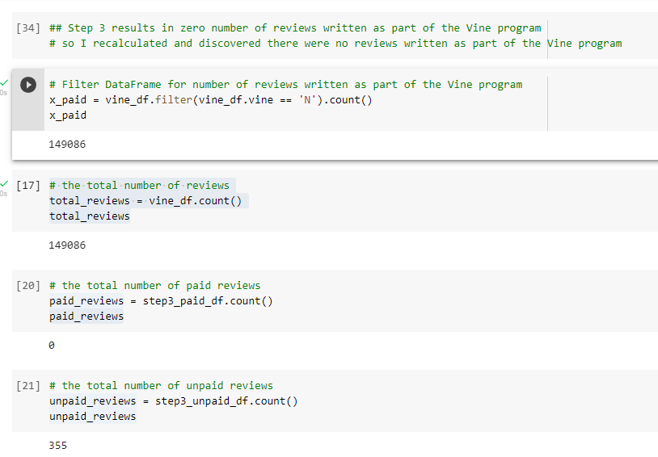
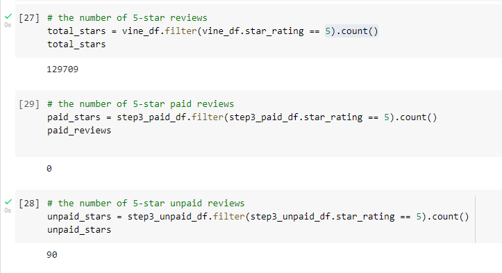
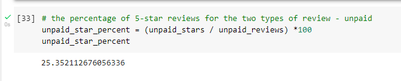

#  Amazon_Vine_Analysis
## Overview
Big Market is a startup that helps optimize marketing efforts.  You have been working on a client, SellBy, analyzing product reviews.  

## Resources
Software(s): Google Colab Notebook, PySpark 3.0.3, pgAdmin 4, Postgresql v11.12, and Amazon Web Services (AWS)<br/>
Data: Amazon review dataasets - amazon_reviews_us_Gift_Card_v1_00.tsv.gz

## Purpose
You have been tasked with analyzing Amazon reviews written by members of the paid Amazon Vine program. The Amazon Vine program is a service that allows manufacturers and publishers to receive reviews for their products. Companies like SellBy pay a small fee to Amazon and provide products to Amazon Vine members, who are then required to publish a review.

You’ll determine if there is any bias towards reviews that were written as part of the Vine program. For this analysis, you'll determine if having a paid Vine review makes a difference in the percentage of 5-star reviews.

## Results

Using bulleted lists and images of DataFrames as support, address the following questions:<br/>

* How many Vine reviews and non-Vine reviews were there?<br/>
All reviews written were non-Vine.<br/>

<br/>

* How many Vine reviews were 5 stars? How many non-Vine reviews were 5 stars?<br/>
As there were no vine reviews, I tested both the total database and the filtered database.  There were a total of 129,709 5-star reviews and of the filtered subset, there were 90.

<br/>

* What percentage of Vine reviews were 5 stars? What percentage of non-Vine reviews were 5 stars?<br/>
As there were no vine reviews, 25.35% percente of non-Vine review son the filtered subset were 5 stars.

<br/>


## Summary

* In your summary, state if there is any positivity bias for reviews in the Vine program. Use the results of your analysis to support your statement.<br/>
As there were no vine reviews, there is no bias for reviews.  In addition, while there were 87% of the total dataset 5-star reviews, after filtering, the percentage dropped to approximately 25%, supporting my findings of no (or extremely low) bias.


* Then, provide one additional analysis that you could do with the dataset to support your statement.<br/>
Additionally, we could count the 5-star ratings of the ```helpful_votes``` to see if those resulted in similar findings and/or include in our filter only ```verified_purchase``` = Y.
